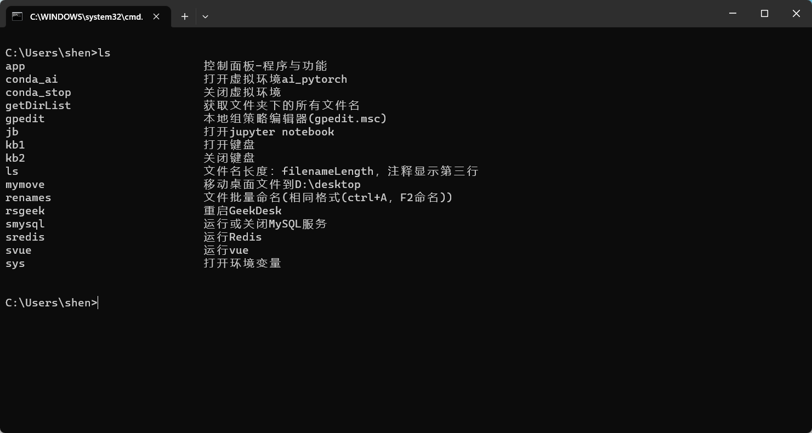
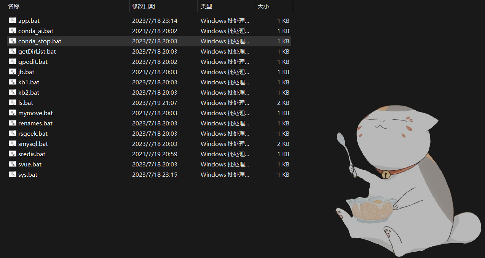

# bat
Fast bat

Record the quick opening of bat script  

The principle is to put the bat script into a folder and configure the environment variables  
Then enter ls in the cmd window to display all script names and associated comments  

Mainly the ls.bat script  
To make ls display as neat as possible  
Set the script filename length to "filenameLength"  
And the comment needs to be placed on the third line and must be prefixed with REM and a space (4 characters in this case)  
You also need to change the path to the destination folder  
